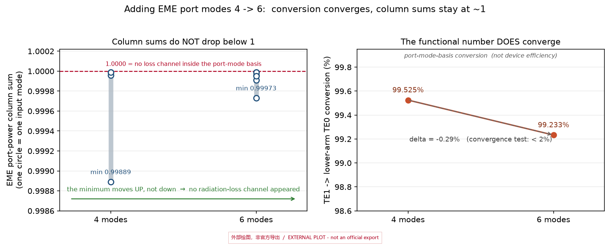

# psr-bilevel-eme-scope

**A reproduction of a public bi-level adiabatic polarization-splitter-rotator (PSR) design on
SOI 220 nm + 90 nm partial etch — plus a scope note on where EME's authority for this device ends.**

**Companion repositories**: the passive-device library this design was selected from
([silicon-photonics-device-library](https://github.com/55093693k-dot/silicon-photonics-device-library)),
and the figure-provenance / reference tools used for its figures
([photonics-fig-tools](https://github.com/55093693k-dot/photonics-fig-tools)).

Short version:

- The mechanism is reproduced and cross-validated by **two independent methods**:
  `TM0 → TE1 = 98.35%` (3D FDTD, taper segment) and `TE1 → lower-arm TE0 = 99.233%`
  (3D EME, coupler segment; passes a 4→6 port-mode convergence check, Δ = −0.29%).
- **Device-level absolute insertion loss is deliberately not quoted.** In this structure the EME
  port-power column sums stay ≈ 1 even after adding port modes (4 → 6), so no radiation-loss
  channel ever appears in the port-mode basis. Adding modes was tested and **falsified as a route**
  to the loss number.
- Read [`§5`](#5-why-this-repo-exists-the-column-sum-observation) for the observation and
  [`§6`](#6-scope--limitations-read-before-quoting-any-number) for the quoting rules.

> **If you want to quote a number from this repo, quote §6 with it.**
> The two referenceable values are `98.35%` and `99.233%`. Everything else here is either
> context, or explicitly not referenceable.

**Status**: mechanism verified; device-level IL **not** certified.
**Archived**: `v1.0.2` (2026-09-26) — DOI **[10.5281/zenodo.22976304](https://doi.org/10.5281/zenodo.22976304)**;
the concept DOI covering every version is **[10.5281/zenodo.22976303](https://doi.org/10.5281/zenodo.22976303)**.

**Cost of the runs reproduced here**: ≈ 0.34 + 0.38 FlexCredit (coupler segment, 4- and 6-mode runs);
the all-device EME run is ≈ 1.34 FlexCredit. All scripts here are self-contained: geometry, materials,
mesh, sources and ports are defined in code.

---

## 1. What this is

The reference design is the public **BilevelPSR** example from the Tidy3D notebook collection
(`docs.flexcompute.com` → notebooks → BilevelPSR). This repository contains:

1. the geometry ported to **SOI 220 nm + 90 nm partial etch** (as-is, official parameter values),
2. the scripts used to verify it, in two independent segments,
3. the raw validation data (CSV) and the run records (Chinese, as originally written),
4. one figure that is the whole point of the exercise — see §5,
5. [`psr_bilevel_eme_scope.ipynb`](psr_bilevel_eme_scope.ipynb) — the same report as a Jupyter
   notebook (the file submitted to the Tidy3D community examples). Its single runnable cell
   re-derives the column sums and the conversion **offline with numpy alone**: no Tidy3D account,
   no API key, no network. The scripts appear in it as source listings, because they are
   command-line programs and do not run as notebook cells (`__file__` / `sys.argv`).

This is a *reproduction and scope* report, not a device datasheet. Nothing here is tape-out advice.

## 2. Platform and geometry

| Parameter | Value | Parameter | Value |
|---|---|---|---|
| Si layer thickness `t_si` | **220 nm** | Partial-etch depth `t_pes` | **90 nm** |
| Slab width `w_pes` | 1.55 µm | Sidewall angle | 10° |
| Input width `w_1` | 0.45 µm | Transition widths `w_2 / w_3` | 0.55 / 0.85 µm |
| Lower-arm entry `w_4` | 0.20 µm | Upper-arm coupler `w_5` | 0.65 µm |
| Lower-arm coupler `w_6` | 0.50 µm | Arm-to-arm `gap` | 0.20 µm |
| `L_blt / L_s / L_ac / L_t` | 100 / 5 / 300 / 30 µm | Output S-bend | R = 300 µm, 2θ = 12° |
| **Total device length** | **≈ 537.8 µm** | Cladding | SiO₂ (n ≈ 1.444) |

> ⚠️ The shipped geometry figure's own caption states a total length of **≈ 523 µm**, while the sum
> of the segment lengths above is **≈ 537.8 µm**. Both come from the same work at different times and
> **the discrepancy is not resolved here** — treat the segment lengths (which appear individually in
> the scripts) as authoritative and re-derive the total if you need it.

**Naming used throughout** (this matters for reading the tables):

- **upper arm** = the **wide** output arm (`w_5 = 0.65 µm`, at y ≈ −0.10 µm) — where an input TE0 stays;
- **lower arm** = the **narrow** output arm (`w_6 = 0.50 µm`, at y ≈ −0.875 µm) — where the rotated TE0 comes out.

Figures: `figures/device_topview.png` (model re-draw; two z-slices) and
`figures/device_cross_section.png` (coupler cross-section).
See [`figures/FIGURES.md`](figures/FIGURES.md) for what each figure is and is **not**.

---

## 3. Results: two independent segments

The mechanism is verified by two **different numerical methods on two different sub-domains**.
Neither one alone would be convincing; together they trace the full adiabatic path.

| Segment | Method / settings | Result |
|---|---|---|
| **taper** (x −6…109 µm, TM0 in) | **3D FDTD** (Tidy3D ModeSource → ModeMonitor at x = 105 µm, 2 modes); 12 steps/λ in-plane plus a 20 nm z-override; `run_time = 3.6 ps` (≥ 2× the optical path time) | **TM0 → TE1 = 98.35%** (TM0 → TE0 = 0.0000); segment IL ≈ **0.072 dB** — this is an **upper bound**, the domain was clipped in y |
| **coupler** (x 100…410 µm, TE1 in) | **3D EME** (`EMEExplicitGrid`, 69 cells; ports at x = 105 / x = 405; **6 modes**, `constraint="passive"`, single frequency 1.55 µm) | **TE1 → lower-arm TE0 = 99.233%** (passes 4→6 convergence, Δ = −0.29% < 2%); TE1 → upper arm 5e-5; TE0 → upper-arm TE0 = 99.805%; TE0 → lower-arm TE0 = 2e-5 |

**Conclusion carried by these two rows**: `TM0 → (taper) TE1 → (adiabatic coupler) lower-arm TE0`,
confirmed by two independent methods on two independent sub-domains.

### 3.1 Port-mode identification (two independent evidences, never by mode index)

Mode index is a queue position, not an identity. Identification uses **effective index *and* the
transverse field centroid**:

| Port | mode | n_eff | field polarity / centroid | identification |
|---|---|---|---|---|
| in, x = 105 | 0 / 1 | **2.7027 / 2.2480** | Ey = 0.902 / 0.659 | upper waveguide **TE0 / TE1** (independent FDTD: 2.7059 / 2.252) |
| out, x = 405 | 0 / 1 | 2.6057 / **2.4391** | centroid **−0.104 / −0.866** (geometric: −0.10 / −0.875) | upper-arm TE0 / **lower-arm TE0** |

Full table including all 6 modes / 12 port modes: `data/PORT_MODE_NEFF.csv` and the field map
`data/PORT_MODE_FIELDS.png` (real \|E_y\|² of the port modes, produced offline from the same EME data).

## 4. Convergence check (4 → 6 port modes)

Single variable changed; domain, ports, mesh, frequency and constraint are byte-identical
(`EME cells = 69`, `y = 6.0`, `constraint = passive`, ports at x = 105 / 405).

| quantity (λ = 1.55 µm) | 4 modes | **6 modes** | Δ | verdict |
|---|---|---|---|---|
| **TE1 → lower-arm TE0** (the device function) | 0.99525 | **0.99233** | **−0.00292 (−0.29%)** | ✅ converged (< 2%) |
| TE0 → upper-arm TE0 (through) | 0.99807 | 0.99805 | −0.00002 | ✅ bit-stable |
| TE1 → upper-arm TE0 (unwanted) | 0.00005 | 0.00005 | 0 | ✅ |
| TE0 → lower-arm TE0 (crosstalk) | 0.00002 | 0.00002 | 0 | ✅ |
| **column sums (min…max)** | 0.99889 … 0.99999 | **0.99973 … 0.99999** | **↑ (closer to 1)** | ❌ **never drops below 1** |
| mean column sum | 0.999707 | 0.999922 | ↑ | — |

Two things are true at once here, and the second one is the reason this repository exists:

1. the **functional** number converges (−0.29%, i.e. it passes the pre-registered < 2% test);
2. the **column sums do not move away from 1** — the minimum actually moves *up*.

**Scope of this check**: this structure, this length scale, 4 → 6 modes. It does **not** prove
"EME can never give insertion loss". Also note that the −0.29% drop is accounted for by the newly
added modes absorbing the difference, so it demonstrates *convergence within the < 2% criterion* —
not convergence to < 1%.

---

## 5. Why this repo exists: the column-sum observation

### 5.1 Origin of the observation

The coupler-segment run with **4 port modes** gives column sums of 0.99889–0.99999 — no loss channel
inside the port-mode basis — while the device function in the same run reads 99.525%.

A second reason not to take that reading at face value: on this route the same device returns widely
inconsistent results depending on the constraint and the port-mode count used.

| run | constraint | port modes | result |
|---|---|---|---|
| all-device | `unitary` | 4 | conversion **92.4–96.7%** across the C-band (9 frequencies, 1.50–1.58 µm) |
| all-device | `passive` | 2 | **TE0 → out0 = 0.14%** (IL **28.539 dB**); TM0 → out1 = 0.03% (IL **34.981 dB**) |

Both rows describe the same device on the same route, and they differ by three orders of magnitude.
They cannot both be device performance; what changed between them is the constraint and the port-mode
count. Every number in that table is therefore marked *not referenceable*, and none of them are quoted
as device performance here.

Provenance: the `passive` row is reproducible from this repository (`sim/run_eme_passive.py`, recorded
output in `notes/log_an_passive_m2.txt`); the `unitary` row is read from that run's record, which is
not shipped here.

### 5.2 The question, and the measured answer

The natural reading of a port-power column sum of exactly ≈ 1 is: *"there is no loss channel inside
the port-mode basis, so if I add more modes the radiation loss will finally have somewhere to go, and
the sums will drop below 1."* That was the question; the 4 → 6 run was designed as a single
variable to test it, with the pre-run criterion that the key channel must change by < 2%.

**It did not happen.** The minimum column sum moved from 0.99889 to 0.99973 — *upward*. Adding modes
did not open a radiation-loss channel in this structure.



*The figure above is the answer, and it has to be read as two panels at once:
**left** — the per-input column sums at 4 and 6 modes. The dashed line at 1.0000 is "no loss channel
inside the port-mode basis". A positive answer would move the points **down** across it; instead
the minimum moves **up** (0.99889 → 0.99973). **Right** — the functional conversion, which *does*
converge: 99.525% → 99.233%, Δ = −0.29%, passing the < 2% test. So: the number that matters for the
device converges, while the number that would give absolute insertion loss never leaves the port-mode
basis. **Both axes are port-mode-basis quantities — the right panel is not a device efficiency.**
The figure is an external (matplotlib) re-plot of the tabulated results, not a solver export; see
[`figures/FIGURES.md`](figures/FIGURES.md).*

### 5.3 What follows, and the honest limits of it

- **Referenceable**: `TM0 → TE1 = 98.35%` (taper, 3D FDTD) and `TE1 → lower-arm TE0 = 99.233%`
  (coupler, 6 modes, converged). Both are **port-mode-basis** conversions.
- **Not referenceable**: device-level absolute insertion loss / return loss from this route.
  The evidence is the column sums above; the remaining options are an **all-device 3D FDTD**
  (estimated ≈ 30 FlexCredit here) or **measurement**.
- **Not covered at all**: the output section (S-bend + `L_t`, x 405…537.8 µm).
- **Not a general claim**: the falsification is scoped to this structure / length scale / 4 → 6 modes.

The formal quoting rules are collected in **§6**, and the two values that may be quoted are the two
listed above.

### 5.4 What this repository does not solve

- The cause of the boundary in §5.3 is **not identified** here.
- A larger port-mode basis (10 or more), and a different constraint, were **not tested** — outside the
  scope of this work.
- The `unitary` vs `passive` discrepancy in §5.1 is **not explained** here;
  both sets of numbers from that pair are marked not referenceable as a result.
- Device-level return loss, and the insertion loss of the output section (S-bend + `L_t`), are **not
  addressed**.

**Companion report**: the report *is* this repository (README §1–§8 plus the notebook). Its permanent,
citable copy is the archived release — DOI
**[10.5281/zenodo.22976304](https://doi.org/10.5281/zenodo.22976304)** (`v1.0.2`, 2026-09-26;
all versions: [10.5281/zenodo.22976303](https://doi.org/10.5281/zenodo.22976303)).

---

## 6. Scope & limitations (read before quoting any number)

> The authoritative wording of this clause is the Chinese original (in `notes/` and in the device
> library this repo was split from). The English below is a faithful translation of it — same claims,
> same scope, nothing added or softened.

1. **Referenceable**:
   - coupler segment **TE1 → lower-arm TE0 = 99.233%**
     (6 modes / `passive` / single frequency λ = 1.55 µm, **passed the 4→6 port-mode convergence
     check, Δ = −0.29%**);
   - taper segment **TM0 → TE1 = 98.35%** (3D FDTD, λ = 1.55 µm).
2. **Not referenceable (uncertified)**: **device-level absolute insertion loss / return loss**.
   Basis (with evidence): EME port column sums ≈ 1 (4 modes 0.99889–0.99999; 6 modes 0.99973–0.99999)
   ⇒ **"increasing the number of port modes" cannot expose radiation loss** (falsified by measurement,
   2026-09-12); that figure must come from an **all-device 3D FDTD** (estimated ≈ 30 FlexCredit here)
   or from **measurement**.
   Also: the **output section (S-bend + `L_t`, x 405…537.8 µm) was not measured**
   ⇒ device-level insertion loss is uncertified.
3. **Single frequency only**: the values above were verified only at λ = 1.55 µm; the bandwidth curves
   remain **unconverged** data ⇒ they may be read as trends only, not as figures of merit.
4. **The taper-segment IL is an upper bound**: the domain was clipped in y ⇒ radiation outside the
   window is absorbed by the PML, so the deviation can only be pessimistic.

**Process requirements.** This design needs **two etch depths** (220 nm full etch + 90 nm partial
etch) and a **0.20 µm arm-to-arm gap**. Total length ≈ 537.8 µm. If area is tight, shrinking `L_ac`
is the lever — at the cost of conversion and bandwidth, which then has to be re-optimised.

## 7. Reproduce

```bash
# dependency: pip install tidy3d==2.12   (and configure your own API key)
python sim/run_bilevel_psr.py --stage geometry       # whole-device structure figures (local, free)
python sim/run_bilevel_psr.py --stage modes          # local mode self-check (free)
python sim/run_bilevel_psr.py --stage eme            # validate + print the cost estimate (no submit)
python sim/run_bilevel_psr.py --stage eme --submit   # submit the all-device EME run

python sim/run_eme_coupler.py --modes 6 --y 6        # coupler segment EME (dry-run first!)
python sim/run_eme_passive.py  --modes 2             # all-device, constraint=passive (dry-run first!)
python sim/run_fdtd_short.py  --pol tm               # taper segment, 3D FDTD (prints T(mode0), T(mode1))
python sim/analyze_coupler_eme.py                    # offline: mode-ID + column sums (4-mode input path)
python sim/analyze_coupler_eme_modes.py --hdf5 <hdf5> # offline: same, any mode count (the 6-mode table in §4)
```

Every script prints a **cost estimate before submitting**; run them without `--submit` first.
Geometry, materials, mesh, sources and ports are all defined in the scripts — nothing depends on
files outside this repository.

**Which script produces which table.** §3's taper readings ← `sim/run_fdtd_short.py`. §4's coupler
tables ← `sim/run_eme_coupler.py --modes 4|6` followed by `sim/analyze_coupler_eme.py` (4-mode input
path) or `sim/analyze_coupler_eme_modes.py --hdf5 <hdf5>` (any mode count). §5.1's `passive` row ←
`sim/run_eme_passive.py --modes 2`, with its recorded analysis output in
`notes/log_an_passive_m2.txt`.

**The same report as a notebook.** [`psr_bilevel_eme_scope.ipynb`](psr_bilevel_eme_scope.ipynb) is
this report in Jupyter form (identical to the copy submitted to the Tidy3D community examples). Its
**§0.1 cell is meant to be run** and needs `numpy` only: it recomputes the §4 column sums and the
conversion straight from the run records, prints them next to the values quoted here, and asserts
them — no Tidy3D account, no API key, no network. The scripts appear in it as **source listings**,
not as cells, because they are command-line programs (`__file__` / `sys.argv`) and do not run as
notebook cells.

| run | configuration | cost |
|---|---|---|
| taper segment 3D FDTD | 2-mode monitor, y-span 3.2 µm | **1.7551 FlexCredit** (run record) |
| all-device EME | 2 modes / 157 cells | **1.335 FlexCredit** (run record) |
| all-device EME | 4 modes / 157 cells | **1.5725 FlexCredit** (run record) |
| all-device EME | `passive`, 2 modes | **0.7727 FlexCredit** (run record) |
| coupler segment EME | 4 modes / 69 cells | **0.3445 FlexCredit** (run record) |
| coupler segment EME | 6 modes / 69 cells | **0.3783 FlexCredit** (**balance-closed**; dry-run = charge to 1e-16) |
| all-device 3D FDTD | — | ≈ 30 FlexCredit (**not run**) |

Costs are as recorded for each run. Only the 6-mode coupler run has a per-run balance-difference
closure; the others are the figures carried in their run records.

## 8. Data files

| file | contents | may it be quoted? |
|---|---|---|
| `data/S_PARAMS.csv` | 9 wavelengths: conversion efficiency, TE0 power budget, absolute \|S21\|² | **only the columns marked in the file header**; `abs_*` columns are affected by port-mode normalisation and **must not** be read as insertion loss |
| `data/PORT_MODE_NEFF.csv` | n_eff and identity of the 12 port modes (6 per port) | yes — it is an identification table |
| `data/PORT_MODE_FIELDS.png` | real \|E_y\|² of the 6 port modes at both ports | yes — evidence for the identification |
| `notes/eme_coupler_4modes.md` | run record, 4-mode coupler segment (Chinese) | source record for §4 |
| `notes/eme_coupler_6modes_convergence.md` | run record, 6-mode convergence check, incl. the self-rebuttal list and the argument behind the negative answer (Chinese) | source record for §4 and §5 |
| `notes/log_an_passive_m2.txt` | offline analysis output of the `passive`, 2-port-mode all-device run (`TE0 → out0 = 0.0014`, IL 28.539 dB) | yes — the evidence for the `passive` row of §5.1 |

**Large outputs are deliberately not in this repo**: the cloud `.hdf5` results and the local solver
project files. They are *results*, not dependencies — the scripts above regenerate them.

## 9. 中文摘要

复刻一个**公开的双台阶锥绝热偏振旋转器设计**到 SOI 220 nm + 90 nm 部分刻蚀平台。
机理用**两段独立方法互证**：taper 段 3D FDTD 给 `TM0 → TE1 = 98.35%`；
耦合器段 3D EME 给 `TE1 → 下臂 TE0 = 99.233%`（已过 4→6 模式收敛，Δ = −0.29%）。

**器件级绝对插损我拒绝给数**：EME 端口功率逐列和恒 ≈ 1，把端口模式数从 4 加到 6 之后
列和**没有**降到 <1（最低值反而从 0.99889 升到 0.99973）—— "加模式数就能暴露辐射损耗"
这条直觉被实测否证。要这个指标只能走全器件 3D FDTD 或流片实测。

**可引用的只有两个数**：`98.35%` 与 `99.233%`；引用时请一并引用 §6 的限制条款。
（配套工程报告**随本仓发布**（英文原文见 §1–§8 与 notebook）；它的永久可引用副本 = 归档版本：
**DOI `10.5281/zenodo.22976304`**（`v1.0.2`，2026-09-26；全部版本用 `10.5281/zenodo.22976303`）。）

## Licence & attribution

- **Code** (`sim/`, `tools/`, all `*.py`): **MIT** — see `LICENSE`.
- **Everything else** (figures `*.png`, data `*.csv`, documents `*.md` and the notebook `*.ipynb`,
  incl. this README and the run records): **CC BY 4.0** — see `LICENSE-figures-and-data.md`.
  In the notebook, only the embedded listings of `sim/*.py` remain MIT (see that file).
- The **reference design** is the public **BilevelPSR** example from Flexcompute / Tidy3D
  (`docs.flexcompute.com`). Its licence and attribution belong to the original authors; this repo
  only provides a platform adaptation plus validation data, and does not reproduce their documents.

**Citing this repository**: `CITATION.cff` carries the citation metadata for GitHub, and
`.zenodo.json` carries the same scope text for the archived record. Cite the repository URL plus
the date you accessed it, and carry the §6 scope with any number you quote. The archived release carries
a DOI: cite **10.5281/zenodo.22976304** (`v1.0.2`, 2026-09-26) for this version, or
**10.5281/zenodo.22976303** for the repository as a whole. `CITATION.cff` also carries the author's ORCID.

**If you reuse a number from here**: please carry the §6 scope with it. Where the number came from a
figure, also state that the figure is an external (matplotlib) re-plot — see `figures/FIGURES.md`.
